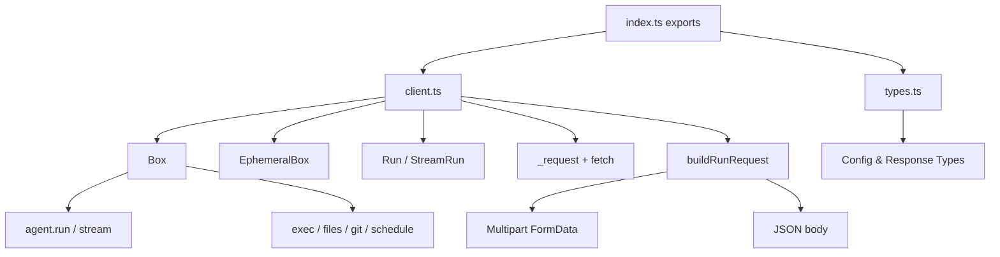

This SDK is intentionally small and explicit. The public surface lives in `packages/sdk/src/index.ts`, while implementation details are concentrated in `packages/sdk/src/client.ts` and type definitions in `packages/sdk/src/types.ts`. The result is a single entry point that exports a focused set of classes and types, with one implementation file that owns all networking and streaming logic.

**Key design decisions (and why)**
- **Single implementation module (`client.ts`)**: The SDK avoids a fragmented class hierarchy. `Box`, `EphemeralBox`, `Run`, and `StreamRun` share the same request and streaming logic, which keeps the surface predictable and makes it easy to reason about side effects. This is visible in `packages/sdk/src/client.ts`, where all class methods delegate to `_request`, `_run`, `_stream`, and `_parseExecStream`.
- **Typed API with lightweight runtime dependencies**: Types are exported from `packages/sdk/src/types.ts` and only one runtime dependency (`zod-to-json-schema`) is used, enabling structured outputs without pulling in a full schema validator at runtime. The SDK accepts a Zod schema and converts it to JSON Schema when needed.
- **Streaming built on SSE parsing**: Both `agent.stream()` and `exec.stream()` parse server-sent events. The agent stream parser understands `run_start`, `text`, `tool`, `done`, and `stats` events, while exec streams parse `event: exit`. This design reduces latency and gives you partial results quickly.
- **Separation of “Box” vs “EphemeralBox”**: Ephemeral boxes are created synchronously and expose only exec, files, and schedules. Internally, `EphemeralBox` wraps a normal `Box` instance and forwards operations, but avoids agent and git functionality. This keeps the API honest about what the backend supports.

**How the pieces fit together**
1. **Entry point**: `index.ts` re-exports public classes and types. This is the only supported import path for application code.
2. **Box creation**: `Box.create()` builds a request body from `BoxConfig` and hits `POST /v2/box`. It then polls until `status !== "creating"`, which keeps the developer experience synchronous and reliable.
3. **Runs**: `box.agent.run()` uses `_executeRun()` to stream output over SSE, buffers text into `rawOutput`, and parses structured output if `responseSchema` is provided. `box.agent.stream()` returns a `StreamRun` that yields `Chunk` objects from the same SSE channel.
4. **Exec and files**: Exec uses `/exec` or `/exec-stream` endpoints, while file operations map to `/files/read`, `/files/write`, `/files/upload`, and `/files/download`. The SDK tracks `cwd` locally and injects `folder` parameters into these calls to keep path usage consistent.
5. **Schedules**: The `schedule` namespace maps to `/schedules` endpoints. These methods are lightweight wrappers that translate `ExecScheduleOptions` and `AgentScheduleOptions` into backend fields.

The end result is a small but powerful client: everything you do is an HTTP request to the Box API, and every response is normalized into a consistent `Run` model with status, result, and cost metadata.
