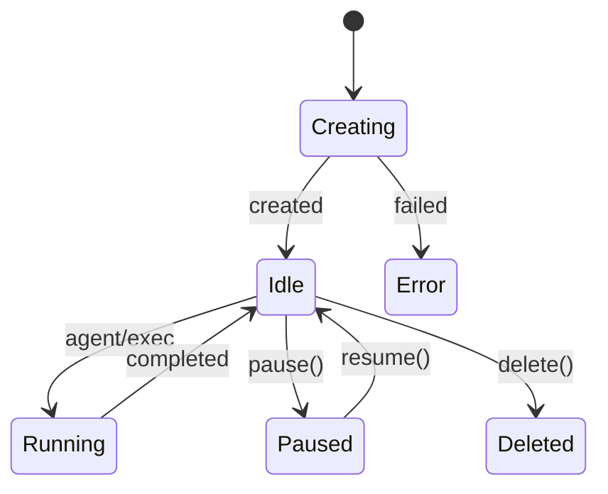

A **Box** is a sandboxed workspace with a runtime, filesystem, and (optionally) an AI agent. An **EphemeralBox** is a lighter-weight variant intended for short-lived tasks, created instantly and auto-deleted after a TTL. Both are created through the Box API, but they differ in lifecycle guarantees and supported features.

**Why this concept exists**
Most AI workflows need real file I/O, command execution, and a stable working directory. A simple prompt API does not provide these affordances. Box solves this by creating an isolated environment that persists between calls, while EphemeralBox offers a cost-effective alternative for quick, disposable tasks.

**How it relates to other concepts**
- **Runs and streaming** happen inside a Box or EphemeralBox.
- **Files and cwd** are tracked per Box and affect every operation.
- **Schedules and webhooks** execute against a specific Box ID.



**How it works internally**
`Box.create()` builds a request body from `BoxConfig` and posts it to `POST /v2/box` in `packages/sdk/src/client.ts`. The SDK then polls the box status every 2 seconds until it is no longer `"creating"`, or a 5-minute timeout is hit. This is why `Box.create()` is async and why it can throw `BoxError("Box creation timed out")`.

`EphemeralBox.create()` uses the same endpoint but sets `ephemeral: true` and skips polling. Internally, it wraps the resulting `Box` instance and forwards exec, files, schedule, and lifecycle methods. The wrapper is a guardrail: it keeps the API honest by not exposing agent or git operations that the backend does not support for ephemeral boxes.

**Basic usage**
```ts filename="create-box.ts"
import { Box, Agent, ClaudeCode } from "@upstash/box";

const box = await Box.create({
  runtime: "node",
  agent: { provider: Agent.ClaudeCode, model: ClaudeCode.Sonnet_4_5 },
});

const run = await box.agent.run({ prompt: "List the files in the workspace." });
console.log(run.result);

await box.pause();
await box.resume();
await box.delete();
```

**Advanced / edge-case usage**
```ts filename="ephemeral-box.ts"
import { EphemeralBox } from "@upstash/box";

const box = await EphemeralBox.create({
  runtime: "python",
  ttl: 1800,
  env: { MODE: "fast" },
});

const run = await box.exec.command("python -c 'print(2 + 2)'" );
console.log(run.result); // "4"

await box.delete(); // optional, but releases resources immediately
```

<Callout type="warn">
Make sure the Box has an agent configured before calling `box.agent.run()` or `box.agent.stream()`. If you create a box without `agent` in `BoxConfig`, those methods throw a `BoxError` with guidance on how to configure the agent. Also ensure `UPSTASH_BOX_API_KEY` is set or passed explicitly, or `Box.create()` will fail immediately.
</Callout>

<Accordions>
<Accordion title="Durable Box vs EphemeralBox">
A durable Box preserves state until you delete it, which is ideal for multi-step coding flows, long-lived agents, and snapshot workflows. Ephemeral boxes are cheaper and faster to create, but they do not support agent or git operations and are auto-deleted after a TTL. If you need to run a single command or process a small set of files, EphemeralBox keeps cost and cleanup overhead low. If you need to iterate on a repository, run multiple prompts, or store snapshots, a full Box is the correct choice.
</Accordion>
<Accordion title="Polling vs Immediate Readiness">
`Box.create()` polls the API until the box transitions out of `creating`. This makes the API simple to use but adds a startup delay. `EphemeralBox.create()` avoids polling to keep latency low, which is why it is recommended for short-lived tasks. If you are launching many boxes in parallel, polling can add a few seconds of overhead that you should plan for in your concurrency model.
</Accordion>
<Accordion title="Resource Size Trade-offs">
Box size determines CPU and memory. Larger boxes can run heavier commands and handle bigger codebases, but they are more expensive and slower to provision. If you only need to run quick scripts or light prompts, `size: "small"` is often sufficient. If you are compiling, running tests, or generating large artifacts, consider `medium` or `large` and measure the run time improvements against cost.
</Accordion>
</Accordions>
