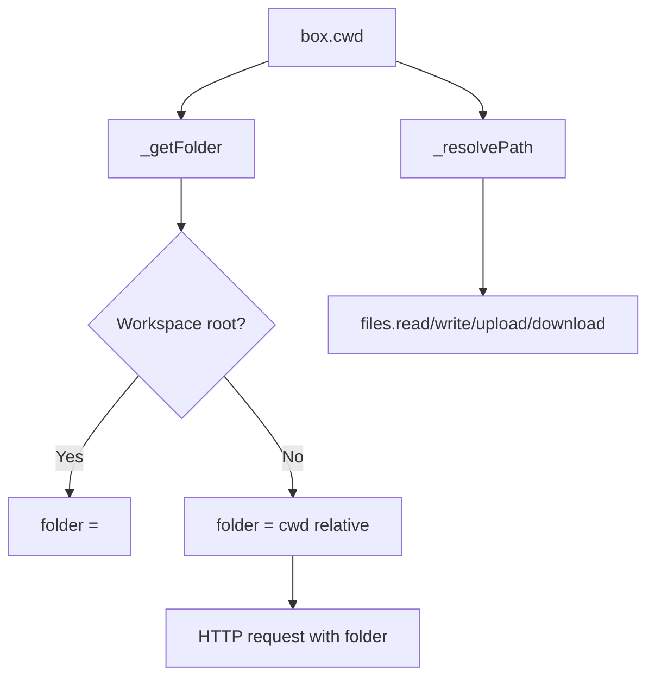

The Box SDK exposes a file system API (`box.files`) and a tracked working directory (`box.cwd`). Together, they let you read and write files, upload assets, and execute commands relative to the same directory without manually rewriting paths.

**Why this concept exists**
AI coding workflows frequently need to read, modify, and generate files. A stable working directory makes it easy to chain operations: clone a repo, `cd` into it, run commands, then stream the output without reconstructing paths every time.

**How it relates to other concepts**
- **Runs** and **exec** inherit the current working directory.
- **Git operations** use the same `cwd` folder by default.
- **Schedules** can override the working directory with `folder`, but default to the Box `cwd`.



**How it works internally**
The SDK tracks `cwd` locally in `packages/sdk/src/client.ts`. `box.cd()` does not change the server's shell state; it updates `_cwd` in memory after verifying that the path exists by running `ls` inside the box. Every file, git, and exec method calls `_getFolder()` or `_resolvePath()` to translate relative paths into absolute box paths or `folder` query parameters.

For uploads, the SDK reads local files and builds a multipart `FormData` request. For downloads, it fetches each file from `/files/download` and writes them to a local directory named after the remote folder, which means downloads affect your local filesystem, not the box.

**Basic usage**
```ts filename="files-basic.ts"
import { Box, Agent, ClaudeCode } from "@upstash/box";

const box = await Box.create({
  runtime: "node",
  agent: { provider: Agent.ClaudeCode, model: ClaudeCode.Sonnet_4_5 },
});

await box.files.write({ path: "notes/todo.txt", content: "Ship the feature" });
const contents = await box.files.read("notes/todo.txt");
console.log(contents);

const entries = await box.files.list("notes");
console.log(entries.map((e) => e.name));

await box.delete();
```

**Advanced / edge-case usage (cwd + downloads)**
```ts filename="files-advanced.ts"
import { Box, Agent, ClaudeCode } from "@upstash/box";

const box = await Box.create({
  runtime: "node",
  agent: { provider: Agent.ClaudeCode, model: ClaudeCode.Sonnet_4_5 },
});

await box.exec.command("mkdir -p /workspace/home/project/src");
await box.cd("project");

await box.files.write({ path: "src/index.ts", content: "export const value = 42;" });

// Downloads write to local disk under ./project
await box.files.download({ folder: "src" });

await box.delete();
```

<Callout type="warn">
`box.cd()` only updates the SDK's internal path. If you run an exec command that changes directories (for example `cd src && ls`), that change does not persist between calls. Also note that `files.download()` writes to your local filesystem, so run it from a directory where you want the output folder to be created.
</Callout>

<Accordions>
<Accordion title="Relative vs Absolute Paths">
Relative paths are resolved against `box.cwd`, which keeps code concise but can be surprising if you forget to update `cwd`. Absolute paths bypass the cwd and are sent as-is. If you are automating across multiple repos inside the same box, use `cd()` and relative paths for each repo, then reset back to `/workspace/home` between steps. This pattern keeps file and git operations consistent without hard-coding long paths.
</Accordion>
<Accordion title="Upload Strategies">
Uploading local files uses multipart form data, which is convenient for binary assets but requires reading from disk on the client side. If your input is already in memory or base64, you can attach files to prompts through `RunOptions.files` instead of uploading first. For large batches, consider compressing files or filtering to the minimal set, since each file counts toward API limits. Choose the path that keeps your latency and payload sizes predictable.
</Accordion>
<Accordion title="Download Semantics">
Downloads are intentionally simple: they fetch each file and write it to a local directory. This works well for small outputs but can be slow for large trees because each file is requested separately. If you need to transfer many files frequently, consider generating a tarball inside the box with `exec.command()` and downloading that single artifact. That approach reduces round trips and often simplifies cleanup.
</Accordion>
</Accordions>
