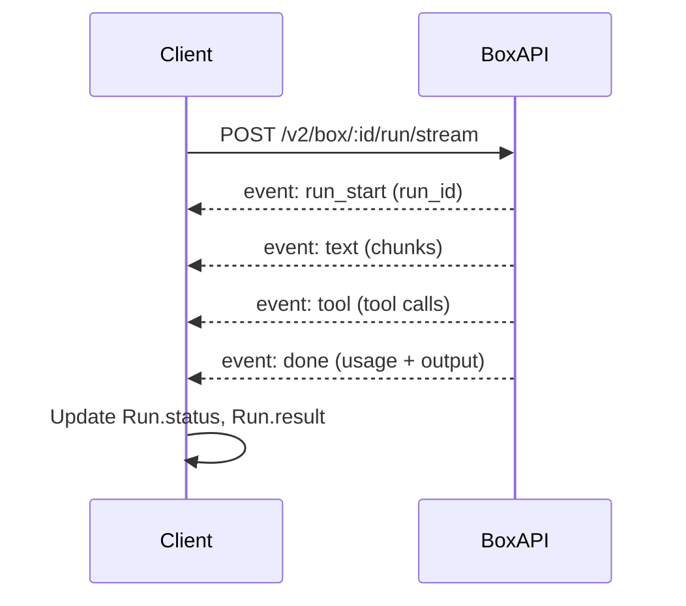

A **Run** represents a single execution inside a Box: an agent prompt, a shell command, or inline code. A **StreamRun** is a Run that yields incremental output chunks as the server sends them. These objects are returned by `box.agent.run()`, `box.agent.stream()`, `box.exec.command()`, and their streaming variants.

**Why this concept exists**
AI tasks can be long-running, and you often need to show partial output, capture tool use, or stop execution early. Runs provide a consistent way to track status, cost, and output across agent and exec workflows, while StreamRun adds async iteration for low-latency UX.

**How it relates to other concepts**
- Runs are created inside a **Box** or **EphemeralBox**.
- **Files and cwd** influence the execution context of each run.
- **Schedules and webhooks** create runs asynchronously and report results out-of-band.



**How it works internally**
`Run` and `StreamRun` live in `packages/sdk/src/client.ts`. A `Run` holds internal fields for `status`, `result`, `exitCode`, and cost. The SDK updates those fields through the private `Run._update()` method to keep state consistent across different call paths.

For `box.agent.run()`, the SDK actually uses the streaming endpoint (`/run/stream`) and consumes the SSE stream fully. It buffers `text` events into `rawOutput`, updates token usage when it sees `done`, and finally parses structured output if you passed a Zod schema. For `box.agent.stream()`, it exposes each parsed SSE event as a `Chunk` so you can render progress or react to tool calls in real time.

Structured output is handled by `toJsonSchema()` which converts your Zod schema into JSON Schema for the API, and then parses the final output string back into a typed object. If parsing fails, the SDK throws a `BoxError` with the raw output preview, which helps debug prompt mismatches.

**Basic usage (structured output)**
```ts filename="structured-run.ts"
import { Box, Agent, ClaudeCode } from "@upstash/box";
import { z } from "zod";

const box = await Box.create({
  runtime: "node",
  agent: { provider: Agent.ClaudeCode, model: ClaudeCode.Sonnet_4_5 },
});

const schema = z.object({ title: z.string(), score: z.number() });

const run = await box.agent.run({
  prompt: "Score this pull request from 0-100 and provide a title.",
  responseSchema: schema,
});

console.log(run.result.title, run.result.score);
await box.delete();
```

**Advanced / edge-case usage (stream + tool hooks)**
```ts filename="streaming-run.ts"
import { Box, Agent, ClaudeCode } from "@upstash/box";

const box = await Box.create({
  runtime: "node",
  agent: { provider: Agent.ClaudeCode, model: ClaudeCode.Sonnet_4_5 },
});

const stream = await box.agent.stream({
  prompt: "Refactor the auth flow and explain the changes.",
  onToolUse: (tool) => {
    console.log("Tool:", tool.name, JSON.stringify(tool.input));
  },
});

for await (const chunk of stream) {
  if (chunk.type === "text-delta") process.stdout.write(chunk.text);
  if (chunk.type === "finish") console.log("
Tokens:", chunk.usage);
}

await box.delete();
```

<Callout type="warn">
If you break out of a `for await` loop early, the SDK marks the run as `detached` because the server may still be executing. If you need to stop execution, call `run.cancel()` explicitly. Also be careful with `responseSchema`: a mismatched schema will throw a `BoxError` even if the model output looks correct to a human.
</Callout>

<Accordions>
<Accordion title="Streaming vs Non-Streaming Runs">
`agent.run()` is simpler to consume, but you only get the final output when the run finishes. `agent.stream()` yields partial output and tool events as they happen, which is essential for interactive UX and progressive rendering. The trade-off is more control flow complexity: you must iterate the stream, handle early exit, and consider detachment. If you are building a CLI or UI, streaming is usually worth the additional logic.
</Accordion>
<Accordion title="Webhook Runs vs Client-Side Waiting">
Webhook runs (`webhook` in `RunOptions`) return immediately and deliver results to a URL later. This is ideal for serverless or background workflows where keeping a connection open is expensive. The downside is you lose real-time progress and must secure and validate incoming webhook payloads. Use webhooks when you can tolerate eventual results and prefer not to block your process.
</Accordion>
<Accordion title="Retries and Timeouts">
`maxRetries` applies an exponential backoff around the underlying streaming request. This helps with transient network issues but can hide persistent failures if your prompt or credentials are invalid. Timeouts are enforced with `AbortController` and produce `BoxError("Run timed out")`, which is distinct from model errors. If you set both, design your retry logic to avoid hammering the API with the same failing prompt.
</Accordion>
</Accordions>
